# Diagrama UML del Juego - Patrones de Diseño

## Diagrama de Clases Completo

```mermaid
classDiagram
    %% ========== CONTROLADOR (c/) ==========

    class GameController {
        -EventBus event_bus
        -Render render
        -SpriteLoader sprite_loader
        -InputHandler input_handler
        -Jugador jugador
        -Nivel nivel_actual
        -GameState estado_actual
        -MenuState menu_state
        -PlayState play_state
        -bool corriendo
        +__init__(ancho, alto, fps)
        +ejecutar()
        +cambiar_estado(nuevo_estado)
        +game_over()
        +victoria()
        +cerrar()
    }

    class EventBus {
        -dict _suscriptores
        +suscribir(evento, callback)
        +emitir(evento, payload)
    }

    class GameState {
        <<interface>>
        +manejar_eventos(eventos)*
        +actualizar()*
        +renderizar()*
    }

    class MenuState {
        -EventBus event_bus
        -Render render
        +manejar_eventos(eventos)
        +actualizar()
        +renderizar()
    }

    class PlayState {
        -EventBus event_bus
        -Render render
        -SpriteLoader sprite_loader
        -InputHandler input_handler
        -Jugador jugador
        -Nivel nivel
        -list~Enemigo~ enemigos
        -list~Buff~ buffos
        -list~Proyectil~ proyectiles
        -BuffManager buff_manager
        +manejar_eventos(eventos)
        +actualizar()
        +renderizar()
        +reset()
        +verificar_derrota()
        +verificar_victoria()
    }

    class StateFactory {
        -EventBus event_bus
        -Render render
        -SpriteLoader sprite_loader
        -InputHandler input_handler
        -Jugador jugador
        -Nivel nivel
        +crear_menu_state() MenuState
        +crear_play_state() PlayState
    }

    class InputHandler {
        -Command comando_izquierda
        -Command comando_derecha
        -Command comando_detener
        -Command comando_salto
        +manejar_movimiento(jugador)
        +manejar_salto(jugador)
    }

    class Command {
        <<interface>>
        +ejecutar(jugador)*
    }

    class MoverIzquierdaCommand {
        +ejecutar(jugador)
    }

    class MoverDerechaCommand {
        +ejecutar(jugador)
    }

    class DetenerCommand {
        +ejecutar(jugador)
    }

    class SaltarCommand {
        +ejecutar(jugador)
    }

    %% ========== MODELO (m/) ==========

    class Jugador {
        +Rect rect
        +float velocidad_x
        +float velocidad_y
        +bool en_suelo
        +bool invencible
        +bool mirando_derecha
        +bool moviendo
        +float escala_visual
        +list auras
        +mover_izquierda()
        +mover_derecha()
        +detener()
        +saltar()
        +update(ancho_mundo, plataformas)
        +aplicar_multiplicador_velocidad(factor)
        +aplicar_impulso_salto(factor)
        +set_invencible(valor)
        +reset_estadisticas()
    }

    class Enemigo {
        +Rect rect
        +float velocidad_x
        +float velocidad_y
        +MovimientoStrategy estrategia
        +Arma arma
        +color color
        +int ultimo_disparo
        +mover()
        +update(plataformas)
    }

    class MovimientoStrategy {
        <<interface>>
        +mover(enemigo)*
    }

    class PatrullaStrategy {
        +mover(enemigo)
    }

    class Arma {
        <<abstract>>
        +str nombre
        +int dano
        +int alcance
        +color color
        +int cooldown_ms
        +int velocidad_proj
        +crear_proyectil(origen_rect, direccion) Proyectil
    }

    class Espada {
        +crear_proyectil(origen_rect, direccion) None
    }

    class Arco {
        +crear_proyectil(origen_rect, direccion) Proyectil
    }

    class Baston {
        +crear_proyectil(origen_rect, direccion) Proyectil
    }

    class Proyectil {
        +Rect rect
        +float vx
        +float vy
        +color color
        +int dano
        +bool vivo
        +update()
    }

    class Nivel {
        +str nombre
        +list~Rect~ plataformas
        +tuple spawn
        +int altura_suelo
        +int ancho_mundo
        +list enemigos
        +list buffos
        +int meta_x
        +desde_archivo(ruta) Nivel$
    }

    class Buff {
        +Rect rect
        +str tipo
        +desde_dict(data) Buff$
    }

    class BuffDecorator {
        <<abstract>>
        +int stacks
        +add_stack()
        +aplicar(jugador) dict*
        +get_visual() dict
    }

    class VelocidadBuff {
        +aplicar(jugador) dict
    }

    class SaltoBuff {
        +aplicar(jugador) dict
    }

    class InvencibleBuff {
        +aplicar(jugador) dict
    }

    class BuffManager {
        -dict buff_classes
        -dict activos
        +activar(tipo, ahora)
        +aplicar(jugador, ahora) dict
        +reset()
    }

    class EnemigoFactory {
        <<factory>>
        +crear(tipo, data) Enemigo$
        -_crear_guerrero(data) Enemigo$
        -_crear_arquero(data) Enemigo$
        -_crear_mago(data) Enemigo$
    }

    class EntidadFactory {
        <<factory>>
        +crear_enemigos(datos_enemigos) list~Enemigo~$
        +crear_buffos(datos_buffos) list~Buff~$
    }

    %% ========== VISTA (v/) ==========

    class Render {
        +Surface ventana
        +int ancho
        +int alto
        +int camara_x
        +Surface fondo_imagen
        +limpiar_pantalla()
        +dibujar_suelo()
        +dibujar_plataformas(plataformas)
        +dibujar_enemigos(enemigos)
        +dibujar_jugador(jugador, sprite)
        +dibujar_buffos(buffos)
        +dibujar_proyectiles(proyectiles)
        +dibujar_buff_timers(buff_timers)
        +dibujar_meta(meta_x)
        +set_camara(camara_x)
        +actualizar_pantalla()
    }

    class SpriteLoader {
        -list sprites_derecha
        -list sprites_izquierda
        -Surface sprite_quieto_derecha
        -Surface sprite_quieto_izquierda
        +cargar_sprites()
        +get_sprite(mirando_derecha, moviendo, frame) Surface
        +get_num_frames() int
    }

    %% ========== RELACIONES ==========

    %% Patrón State
    GameState <|-- MenuState : implements
    GameState <|-- PlayState : implements
    StateFactory ..> MenuState : creates
    StateFactory ..> PlayState : creates
    GameController --> StateFactory : usa
    GameController --> GameState : tiene estado actual

    %% Patrón Command
    Command <|-- MoverIzquierdaCommand : implements
    Command <|-- MoverDerechaCommand : implements
    Command <|-- DetenerCommand : implements
    Command <|-- SaltarCommand : implements
    InputHandler --> Command : usa comandos
    Command ..> Jugador : ejecuta sobre

    %% Patrón Observer (Event Bus)
    GameController --> EventBus : usa
    MenuState --> EventBus : emite eventos
    PlayState --> EventBus : emite eventos

    %% Patrón Strategy
    MovimientoStrategy <|-- PatrullaStrategy : implements
    Enemigo --> MovimientoStrategy : usa estrategia

    %% Patrón Decorator
    BuffDecorator <|-- VelocidadBuff : implements
    BuffDecorator <|-- SaltoBuff : implements
    BuffDecorator <|-- InvencibleBuff : implements
    BuffManager --> BuffDecorator : gestiona decoradores
    BuffDecorator ..> Jugador : decora
    PlayState --> BuffManager : usa

    %% Patrón Factory Method
    EnemigoFactory ..> Enemigo : crea
    EntidadFactory ..> Enemigo : crea
    EntidadFactory ..> Buff : crea
    EntidadFactory --> EnemigoFactory : usa
    Nivel ..> Nivel : factory method

    %% Herencia de Armas
    Arma <|-- Espada : extends
    Arma <|-- Arco : extends
    Arma <|-- Baston : extends
    Enemigo --> Arma : tiene arma
    Arma ..> Proyectil : crea

    %% MVC - Composición
    GameController --> Render : vista
    GameController --> Jugador : modelo
    GameController --> InputHandler : controlador
    GameController --> Nivel : modelo
    GameController --> SpriteLoader : vista

    PlayState --> Jugador : gestiona
    PlayState --> Enemigo : gestiona lista
    PlayState --> Proyectil : gestiona lista
    PlayState --> Buff : gestiona lista
    PlayState --> Nivel : usa
    PlayState --> Render : usa
    PlayState --> SpriteLoader : usa
    PlayState --> InputHandler : usa

    Render ..> Jugador : dibuja
    Render ..> Enemigo : dibuja
    Render ..> Buff : dibuja
    Render ..> Proyectil : dibuja
```

## Patrones Identificados en el Diagrama

### 1. **MVC (Model-View-Controller)**
- **Model**: Jugador, Enemigo, Nivel, Arma, Buff, Proyectil
- **View**: Render, SpriteLoader
- **Controller**: GameController, InputHandler, GameState

### 2. **State Pattern**
- GameState (interfaz)
- MenuState, PlayState (estados concretos)
- StateFactory (crea estados)

### 3. **Command Pattern**
- Command (interfaz)
- MoverIzquierdaCommand, MoverDerechaCommand, DetenerCommand, SaltarCommand
- InputHandler (invocador)

### 4. **Observer Pattern (Event Bus)**
- EventBus con suscriptores y emisores

### 5. **Strategy Pattern**
- MovimientoStrategy (interfaz)
- PatrullaStrategy (estrategia concreta)
- Enemigo usa estrategia

### 6. **Decorator Pattern**
- BuffDecorator (decorador base)
- VelocidadBuff, SaltoBuff, InvencibleBuff (decoradores concretos)
- BuffManager gestiona decoradores

### 7. **Factory Method Pattern**
- StateFactory crea estados
- EntidadFactory crea entidades
- Nivel.desde_archivo() crea niveles

### 8. **Abstract Factory Pattern**
- EnemigoFactory crea enemigos con armas específicas

### 9. **Facade Pattern**
- GameController actúa como fachada del sistema

## Visualización Online

Puedes visualizar este diagrama en:
- https://mermaid.live/
- GitHub (automáticamente renderiza Mermaid)
- VS Code con extensión "Markdown Preview Mermaid Support"
