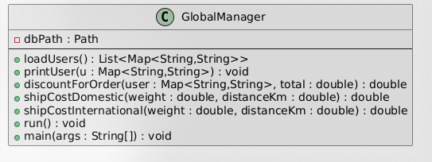
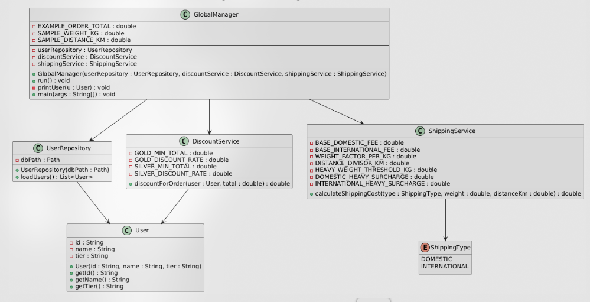

# Taller Anti-patrones

Modelos de Programacion  
Presentado por: Diego Felipe Barreto Rubiano — 20221020151  
Universidad Distrital Francisco Jose de Caldas — Facultad de Ingenieria  
Bogota D.C

## Que antipatrones se encuentran en el codigo Java
**God Object**  
La clase `GlobalManager` concentraba la lectura de usuarios (`loadUsers`), el procesamiento con `Map<String,String>`, el calculo de descuentos, el calculo de envios, la impresion de resultados y `main`. Al mezclar datos, logica de negocio y presentacion en un solo lugar se vuelve dificil de mantener, probar y extender.

**Copy - paste programming**  
`shipCostDomestic` y `shipCostInternational` calculaban lo mismo (`weight * 0.3 + distanceKm / 250`), solo cambiaban la base (6 vs 8), la condicion (> vs >=) y el recargo (+2 vs +3). Rompe DRY y es facil dejar inconsistencias.

**Magic Numbers**  
Valores como `199.99`, `6`, `8`, `0.3`, `250`, umbrales y recargos aparecen sin contexto y duplicados. Si cambian las reglas de negocio hay que cazar numeros por el codigo.

## FASE 1: GlobalManager deja de ser una “Clase Dios”
Solucion aplicada: Separacion de responsabilidades (SRP).  
`GlobalManager` orquesta; `User` modela el dominio; `UserRepository` lee `users.csv`; `DiscountService` calcula descuentos; `ShippingService` calcula envios (aun con duplicacion y numeros magicos).

```java
// ---------------------------------------------------------
// FASE 1: GlobalManager deja de ser una "Clase Dios"
// ---------------------------------------------------------
public class GlobalManager {
    private final UserRepository userRepository;
    private final DiscountService discountService;
    private final ShippingService shippingService;

    public GlobalManager(UserRepository userRepository, DiscountService discountService, ShippingService shippingService) {
        this.userRepository = userRepository;
        this.discountService = discountService;
        this.shippingService = shippingService;
    }

    public void run() {
        List<User> users = userRepository.loadUsers();
        for (User u : users) {
            printUser(u);
            // Todavia usamos numeros magicos aqui
            double total = 199.99;
            double d = discountService.discountForOrder(u, total);
            System.out.println("Descuento: " + d);
            System.out.println("Envio nacional: " + shippingService.shipCostDomestic(12, 900));
            System.out.println("Envio internacional: " + shippingService.shipCostInternational(12, 900));
        }
    }

    private void printUser(User u) {
        System.out.printf("[%s] %s - tier=%s%n", u.getId(), u.getName(), u.getTier());
    }

    public static void main(String[] args) {
        Path dbPath = Paths.get("users.csv");
        // Dependencias antes embebidas en GlobalManager
        UserRepository userRepository = new UserRepository(dbPath);
        DiscountService discountService = new DiscountService();
        ShippingService shippingService = new ShippingService();
        new GlobalManager(userRepository, discountService, shippingService).run();
    }
}

// User: modelo de dominio
class User {
    private final String id;
    private final String name;
    private final String tier;
    public User(String id, String name, String tier) {
        this.id = id;
        this.name = name;
        this.tier = tier;
    }
    public String getId()   { return id; }
    public String getName() { return name; }
    public String getTier() { return tier; }
}

// UserRepository: antes loadUsers estaba en GlobalManager
class UserRepository {
    private final Path dbPath;
    public UserRepository(Path dbPath) { this.dbPath = dbPath; }
    public List<User> loadUsers() {
        List<User> list = new ArrayList<>();
        if (!Files.exists(dbPath)) return list;
        try (BufferedReader br = Files.newBufferedReader(dbPath)) {
            String line;
            while ((line = br.readLine()) != null) {
                // CSV: id;name;tier
                String[] parts = line.split(";");
                String id   = parts.length > 0 ? parts[0] : "";
                String name = parts.length > 1 ? parts[1] : "";
                String tier = parts.length > 2 ? parts[2] : "";
                list.add(new User(id, name, tier));
            }
        } catch (IOException e) {
            e.printStackTrace();
        }
        return list;
    }
}

// DiscountService: antes discountForOrder estaba en GlobalManager
class DiscountService {
    public double discountForOrder(User user, double total) {
        String tier = user.getTier() != null ? user.getTier() : "";
        if ("gold".equals(tier) && total > 200) return total * 0.20;
        if ("silver".equals(tier) && total > 50) return total * 0.10;
        return 0.0;
    }
}

// ShippingService: antes shipCostDomestic/International estaban en GlobalManager
class ShippingService {
    public double shipCostDomestic(double weight, double distanceKm) {
        double base = 6;
        double variable = weight * 0.3 + (distanceKm / 250);
        if (weight > 15) variable += 2;
        return base + variable;
    }
    public double shipCostInternational(double weight, double distanceKm) {
        double base = 8; // distinto
        double variable = weight * 0.3 + (distanceKm / 250);
        if (weight >= 15) variable += 3; // >= y +3 en vez de +2
        return base + variable;
    }
}
```

## FASE 2: eliminamos copy–paste en envios
¿Por que habia copy–paste? `shipCostDomestic` y `shipCostInternational` duplicaban formula y cambiaban base/condicion/recargo.  
Solucion aplicada: se introduce `ShippingType` (DOMESTIC, INTERNATIONAL) y se reemplazan los dos metodos por uno solo, manteniendo las diferencias de negocio.

```java
// ---------------------------------------------------------
// FASE 2: eliminamos codigo duplicado en envios
// ---------------------------------------------------------
public class GlobalManager {
    private final UserRepository userRepository;
    private final DiscountService discountService;
    private final ShippingService shippingService;

    public GlobalManager(UserRepository userRepository, DiscountService discountService, ShippingService shippingService) {
        this.userRepository = userRepository;
        this.discountService = discountService;
        this.shippingService = shippingService;
    }

    public void run() {
        List<User> users = userRepository.loadUsers();
        for (User u : users) {
            printUser(u);
            // Numeros magicos aun presentes (se corrigen en FASE 3)
            double total = 199.99;
            double d = discountService.discountForOrder(u, total);
            System.out.println("Descuento: " + d);

            double domestic = shippingService.calculateShippingCost(ShippingType.DOMESTIC, 12, 900);
            double international = shippingService.calculateShippingCost(ShippingType.INTERNATIONAL, 12, 900);
            System.out.println("Envio nacional: " + domestic);
            System.out.println("Envio internacional: " + international);
            System.out.println("---------------------------------------");
        }
    }

    private void printUser(User u) {
        System.out.printf("[%s] %s - tier=%s%n", u.getId(), u.getName(), u.getTier());
    }
}

// ---------------------------------------------------------
// User: modelo de dominio
// ---------------------------------------------------------
class User {
    private final String id;
    private final String name;
    private final String tier; // "gold", "silver", etc.
    public User(String id, String name, String tier) {
        this.id = id;
        this.name = name;
        this.tier = tier;
    }
    public String getId()   { return id; }
    public String getName() { return name; }
    public String getTier() { return tier; }
}

// ---------------------------------------------------------
// UserRepository: acceso a datos (lectura de users.csv)
// ---------------------------------------------------------
class UserRepository {
    private final Path dbPath;
    public UserRepository(Path dbPath) { this.dbPath = dbPath; }
    public List<User> loadUsers() {
        List<User> list = new ArrayList<>();
        if (!Files.exists(dbPath)) return list;
        try (BufferedReader br = Files.newBufferedReader(dbPath)) {
            String line;
            while ((line = br.readLine()) != null) {
                // CSV: id;name;tier
                String[] parts = line.split(";");
                String id   = parts.length > 0 ? parts[0] : "";
                String name = parts.length > 1 ? parts[1] : "";
                String tier = parts.length > 2 ? parts[2] : "";
                list.add(new User(id, name, tier));
            }
        } catch (IOException e) {
            e.printStackTrace();
        }
        return list;
    }
}

// ---------------------------------------------------------
// DiscountService: logica de descuentos
// (todavia con numeros magicos; se mejora en FASE 3)
// ---------------------------------------------------------
class DiscountService {
    public double discountForOrder(User user, double total) {
        String tier = user.getTier() != null ? user.getTier() : "";
        if ("gold".equals(tier) && total > 200) return total * 0.20;
        if ("silver".equals(tier) && total > 50) return total * 0.10;
        return 0.0;
    }
}

// ---------------------------------------------------------
// FASE 2: eliminamos codigo duplicado en envios
// ---------------------------------------------------------
enum ShippingType { DOMESTIC, INTERNATIONAL }

class ShippingService {
    public double calculateShippingCost(ShippingType type, double weight, double distanceKm) {
        double base;
        if (type == ShippingType.DOMESTIC) {
            base = 6;   // antes shipCostDomestic
        } else {
            base = 8;   // antes shipCostInternational
        }
        double variable = weight * 0.3 + (distanceKm / 250);
        // DOMESTIC: if (weight > 15) +2
        // INTERNATIONAL: if (weight >= 15) +3
        if (type == ShippingType.DOMESTIC && weight > 15) {
            variable += 2;
        }
        if (type == ShippingType.INTERNATIONAL && weight >= 15) {
            variable += 3;
        }
        return base + variable;
    }
}
```

## FASE 3: eliminamos numeros magicos (codigo final en un solo archivo)
Solucion practica: reemplazar todos los literales por constantes con nombre, dejando un solo archivo `src/GlobalManager.java` que contiene todas las clases (GlobalManager, User, UserRepository, DiscountService, ShippingType, ShippingService).

```java
import java.io.BufferedReader;
import java.io.IOException;
import java.nio.file.Files;
import java.nio.file.Path;
import java.nio.file.Paths;
import java.util.ArrayList;
import java.util.List;

// ---------------------------------------------------------
// FASE 3: GlobalManager (Clase Dios corregida, sin numeros magicos)
// ---------------------------------------------------------
public class GlobalManager {

    // Valores de ejemplo extraidos como constantes
    private static final double EXAMPLE_ORDER_TOTAL = 199.99;
    private static final double SAMPLE_WEIGHT_KG = 12.0;
    private static final double SAMPLE_DISTANCE_KM = 900.0;

    private final UserRepository userRepository;
    private final DiscountService discountService;
    private final ShippingService shippingService;

    public GlobalManager(UserRepository userRepository, DiscountService discountService, ShippingService shippingService) {
        this.userRepository = userRepository;
        this.discountService = discountService;
        this.shippingService = shippingService;
    }

    public void run() {
        List<User> users = userRepository.loadUsers();
        for (User u : users) {
            printUser(u);

            double discount = discountService.discountForOrder(u, EXAMPLE_ORDER_TOTAL);
            System.out.println("Descuento: " + discount);

            double domestic = shippingService.calculateShippingCost(
                    ShippingType.DOMESTIC,
                    SAMPLE_WEIGHT_KG,
                    SAMPLE_DISTANCE_KM
            );
            double international = shippingService.calculateShippingCost(
                    ShippingType.INTERNATIONAL,
                    SAMPLE_WEIGHT_KG,
                    SAMPLE_DISTANCE_KM
            );

            System.out.println("Envio nacional: " + domestic);
            System.out.println("Envio internacional: " + international);
            System.out.println("---------------------------------------");
        }
    }

    private void printUser(User u) {
        System.out.printf("[%s] %s - tier=%s%n",
                u.getId(),
                u.getName(),
                u.getTier()
        );
    }

    public static void main(String[] args) {
        Path dbPath = Paths.get("users.csv");

        UserRepository userRepository = new UserRepository(dbPath);
        DiscountService discountService = new DiscountService();
        ShippingService shippingService = new ShippingService();

        new GlobalManager(userRepository, discountService, shippingService).run();
    }
}

// User: modelo de dominio
class User {
    private final String id;
    private final String name;
    private final String tier; // "gold", "silver", etc.

    public User(String id, String name, String tier) {
        this.id = id;
        this.name = name;
        this.tier = tier;
    }

    public String getId()   { return id; }
    public String getName() { return name; }
    public String getTier() { return tier; }
}

// UserRepository: acceso a datos (lectura de users.csv)
class UserRepository {

    private final Path dbPath;

    public UserRepository(Path dbPath) {
        this.dbPath = dbPath;
    }

    public List<User> loadUsers() {
        List<User> list = new ArrayList<>();
        if (!Files.exists(dbPath)) return list;

        try (BufferedReader br = Files.newBufferedReader(dbPath)) {
            String line;
            while ((line = br.readLine()) != null) {
                // CSV: id;name;tier
                String[] parts = line.split(";");
                String id   = parts.length > 0 ? parts[0] : "";
                String name = parts.length > 1 ? parts[1] : "";
                String tier = parts.length > 2 ? parts[2] : "";
                list.add(new User(id, name, tier));
            }
        } catch (IOException e) {
            e.printStackTrace();
        }
        return list;
    }
}

// DiscountService: logica de descuentos (sin numeros magicos)
class DiscountService {

    // Constantes en lugar de numeros magicos
    private static final double GOLD_MIN_TOTAL = 200.0;
    private static final double GOLD_DISCOUNT_RATE = 0.20;
    private static final double SILVER_MIN_TOTAL = 50.0;
    private static final double SILVER_DISCOUNT_RATE = 0.10;

    public double discountForOrder(User user, double total) {
        String tier = user.getTier() != null ? user.getTier() : "";

        if ("gold".equalsIgnoreCase(tier) && total > GOLD_MIN_TOTAL) {
            return total * GOLD_DISCOUNT_RATE;
        }
        if ("silver".equalsIgnoreCase(tier) && total > SILVER_MIN_TOTAL) {
            return total * SILVER_DISCOUNT_RATE;
        }
        return 0.0;
    }
}

// ShippingType: tipo de envio (DOMESTIC / INTERNATIONAL)
enum ShippingType {
    DOMESTIC,
    INTERNATIONAL
}

// ShippingService: calculo de envios (duplicacion + numeros magicos corregidos)
class ShippingService {

    // Tarifas base
    private static final double BASE_DOMESTIC_FEE = 6.0;
    private static final double BASE_INTERNATIONAL_FEE = 8.0;

    // Factores de calculo
    private static final double WEIGHT_FACTOR_PER_KG = 0.3;
    private static final double DISTANCE_DIVISOR_KM = 250.0;

    // Umbral de peso y recargos
    private static final double HEAVY_WEIGHT_THRESHOLD_KG = 15.0;
    private static final double DOMESTIC_HEAVY_SURCHARGE = 2.0; // > 15 kg
    private static final double INTERNATIONAL_HEAVY_SURCHARGE = 3.0; // >= 15 kg

    public double calculateShippingCost(ShippingType type,
                                        double weight,
                                        double distanceKm) {

        double baseFee = (type == ShippingType.DOMESTIC)
                ? BASE_DOMESTIC_FEE
                : BASE_INTERNATIONAL_FEE;

        double variable = weight * WEIGHT_FACTOR_PER_KG
                        + (distanceKm / DISTANCE_DIVISOR_KM);

        if (type == ShippingType.DOMESTIC && weight > HEAVY_WEIGHT_THRESHOLD_KG) {
            variable += DOMESTIC_HEAVY_SURCHARGE;
        }
        if (type == ShippingType.INTERNATIONAL && weight >= HEAVY_WEIGHT_THRESHOLD_KG) {
            variable += INTERNATIONAL_HEAVY_SURCHARGE;
        }

        return baseFee + variable;
    }
}
```

## Diagramas de clase (del documento)
- Codigo original: 
- Codigo aplicando las 3 fases (Good Object, Copy-Paste, Magic Numbers): 

## Estructura actual (archivo unico)
- `src/GlobalManager.java`: contiene GlobalManager, User, UserRepository, DiscountService, ShippingType y ShippingService (fase 3, sin numeros magicos).

## Como ejecutar
```bash
javac -d bin src/GlobalManager.java
java -cp bin GlobalManager
```

El archivo `users.csv` debe existir en el directorio raiz y usar el formato `id;name;tier` (ejemplo: `1;Alice;gold`).
